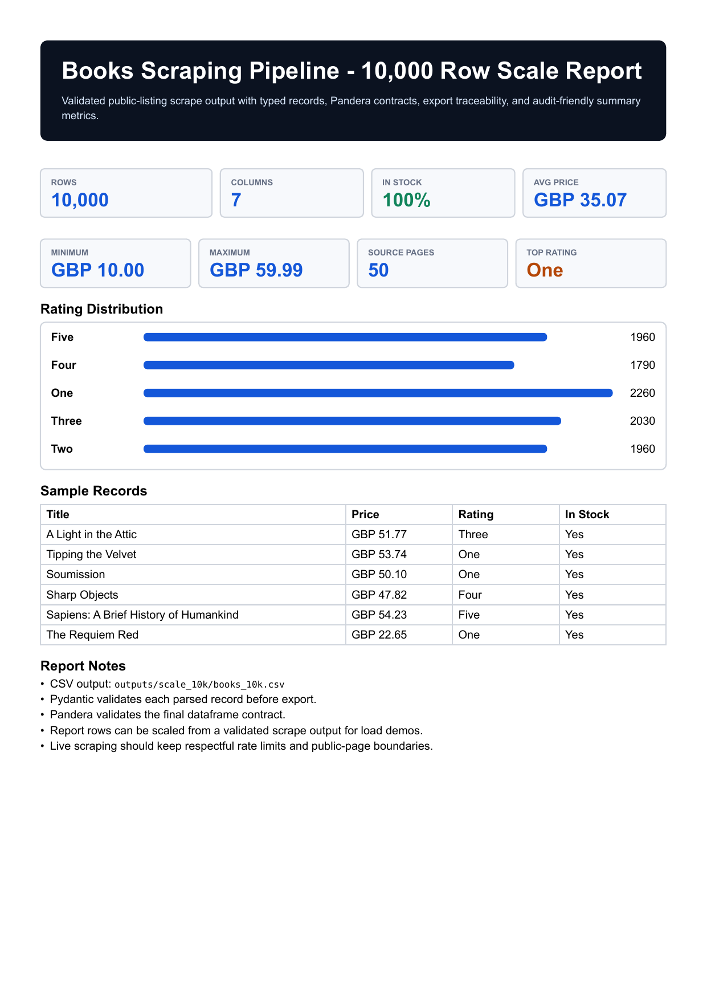

# Scrape Quality Pipeline

[](https://github.com/emirhuseynrmx/scraping-data-pipeline/actions)
[](https://codecov.io/gh/emirhuseynrmx/scraping-data-pipeline)
[](https://www.python.org/)

Async Python scraping pipeline. Two real runs committed — 1,000 books and 117 laptops — both Pandera-validated, manifest-tracked, Parquet/CSV/JSONL export.

```
# books.toscrape.com — 1,000 records across 50 pages
run_id   : 0606b9bb35414bc2aafe07a1c83007ba
pages    : 50  (https://books.toscrape.com/catalogue/page-{2..50}.html)
records  : 1,000
elapsed  : 27s
backend  : selectolax
export   : examples/books.csv  +  examples/scrape_manifest.json

# webscraper.io e-commerce — 117 laptop listings
run_id   : 01fd95c5a8214f60a32613cfbec77570
pages    : 1   (https://webscraper.io/test-sites/e-commerce/allinone/computers/laptops)
records  : 117
elapsed  : 2.8s
backend  : selectolax
export   : examples/laptops.csv  +  examples/laptops_manifest.json
```

A production-style Python web scraping pipeline with selector configs, typed records, data validation, exports, tests, CI, and coverage reporting.

- async HTTP client with retry, timeout, and polite request pacing
- reusable `BaseScraper` class for config-driven listing pipelines
- config-driven selectors for reusable listing scrapers — swapping the target site requires only a new `ScraperConfig`
- parser backend support for `selectolax` and BeautifulSoup + `lxml`
- Pydantic v2 models for record-level validation
- `pandera` schema validation before exporting data
- CSV, JSONL, Excel, and Parquet export
- per-run `scrape_manifest.json` with source pages, schema columns, and output path
- Rich progress output, retry logging, and structured failed-page logging
- offline unit tests with fixtures
- GitHub Actions + Codecov-ready coverage

This is intentionally more than a one-file scraper. The goal is to show how a small scraping project can be structured like maintainable data infrastructure: clear boundaries, reproducible tests, typed models, and validation before data leaves the pipeline.

## Demo

```bash
pip install -e ".[dev]"

# scrape all 1,000 books (50 pages)
scrape-books --pages 50 --out examples/books.csv

# scrape 117 laptop listings from a tech e-commerce store
scrape-laptops --out examples/laptops.csv
```

Use a selector config instead of the built-in default:

```bash
scrape-books \
  --pages 2 \
  --config examples/configs/books_to_scrape.json \
  --parser beautifulsoup \
  --out examples/books.xlsx \
  --format xlsx
```

## Preview


Generate a PDF report from the sample output:

```bash
generate-scraping-report examples/books_sample.csv --out outputs/sample_report
```



### Books output columns

| column | meaning |
| --- | --- |
| `title` | Book title |
| `price_gbp` | Parsed numeric price (GBP) |
| `rating` | Star rating text (One – Five) |
| `in_stock` | Availability flag |
| `product_url` | Absolute product URL |
| `source_url` | Listing page URL |
| `scraped_at` | UTC extraction timestamp |

### Laptops output columns

| column | meaning |
| --- | --- |
| `name` | Product name (full model string from `title` attribute) |
| `price_usd` | Parsed numeric price (USD) |
| `description` | Full spec string |
| `rating` | Star count (1–5) |
| `review_count` | Number of reviews |
| `product_url` | Absolute product URL |
| `source_url` | Listing page URL |
| `scraped_at` | UTC extraction timestamp |

## Why Pandera?

Scraping is not finished when HTML is parsed. Reliable scraping needs data contracts:

- prices must be numeric and positive
- URLs must be valid HTTP(S) URLs
- ratings must be in the expected range
- exported columns must not silently drift

`pandera` catches those issues before a bad CSV reaches a dashboard, CRM, notebook, or database.

## Run Tests

```bash
pytest
```

Expected coverage includes:

- parser behavior on stable fixture HTML
- selector config parsing with multiple parser backends
- schema validation success/failure
- pipeline orchestration without live network calls
- CSV, JSONL, Excel, and Parquet export

## Selector Configs

Reusable scraper settings live in `examples/configs/`. A config controls:

- listing page URL pattern
- card selector
- title, price, rating, availability, and link selectors
- parser backend: `selectolax` or `beautifulsoup`

The built-in scrapers use the same config path internally, so they serve as templates for other listing pages.

## Ethical Scraping Defaults

This project is a technical demo. Real scraping work should include:

- robots.txt and terms review
- reasonable rate limits
- clear user-agent
- no login bypassing
- no collection of private or sensitive data
- caching where possible
