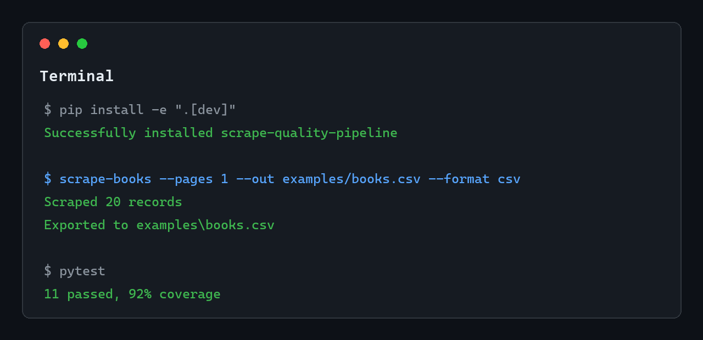
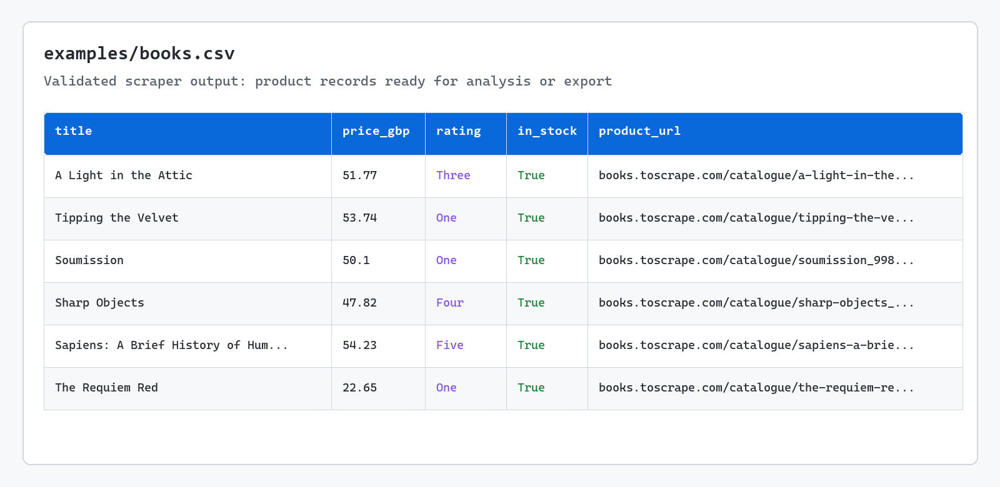

# Scrape Quality Pipeline

[](https://github.com/emirhuseynrmx/scraping-data-pipeline/actions)
[](https://codecov.io/gh/emirhuseynrmx/scraping-data-pipeline)
[](https://www.python.org/)

Built as a reusable scraping/data extraction template for CSV, Excel, and analytics workflows.

A production-style Python web scraping pipeline with selector configs, typed records, data validation, exports, tests, CI, and coverage reporting.

- async HTTP client with retry, timeout, and polite request pacing
- reusable `BaseScraper` class for config-driven listing pipelines
- config-driven selectors for reusable listing scrapers
- parser backend support for `selectolax` and BeautifulSoup + `lxml`
- Pydantic v2 models for record-level validation
- `pandera` schema validation before exporting data
- CSV, JSONL, Excel, and Parquet export
- Rich progress output, retry logging, and structured failed-page logging
- offline unit tests with fixtures
- GitHub Actions + Codecov-ready coverage

This is intentionally more than a one-file scraper. The goal is to show how a small scraping project can be structured like maintainable data infrastructure: clear boundaries, reproducible tests, typed models, and validation before data leaves the pipeline.

## Demo

```bash
pip install -e ".[dev]"
scrape-books --pages 2 --out examples/books.csv --format csv
```

Use a selector config instead of the built-in default:

```bash
scrape-books \
  --pages 2 \
  --config examples/configs/books_to_scrape.json \
  --parser beautifulsoup \
  --out examples/books.xlsx \
  --format xlsx
```

## Preview





Example output columns:

| column | meaning |
| --- | --- |
| `title` | Product title |
| `price_gbp` | Parsed numeric price |
| `rating` | Star rating text |
| `in_stock` | Availability flag |
| `product_url` | Absolute product URL |
| `source_url` | Listing page URL |
| `scraped_at` | UTC extraction timestamp |

## Why Pandera?

Scraping is not finished when HTML is parsed. Reliable scraping needs data contracts:

- prices must be numeric and positive
- URLs must be valid HTTP(S) URLs
- ratings must be one of the expected values
- exported columns must not silently drift

`pandera` catches those issues before a bad CSV reaches a dashboard, CRM, notebook, or database.

## Run Tests

```bash
pytest
```

Expected coverage includes:

- parser behavior on stable fixture HTML
- selector config parsing with multiple parser backends
- schema validation success/failure
- pipeline orchestration without live network calls
- CSV, JSONL, Excel, and Parquet export

## Selector Configs

Reusable scraper settings live in `examples/configs/`. A config controls:

- listing page URL pattern
- card selector
- title, price, rating, availability, and link selectors
- parser backend: `selectolax` or `beautifulsoup`

The built-in `books.toscrape.com` scraper uses the same config path internally, so the demo is also a template for other listing pages.

## Ethical Scraping Defaults

This project is a technical demo. Real scraping work should include:

- robots.txt and terms review
- reasonable rate limits
- clear user-agent
- no login bypassing
- no collection of private or sensitive data
- caching where possible
